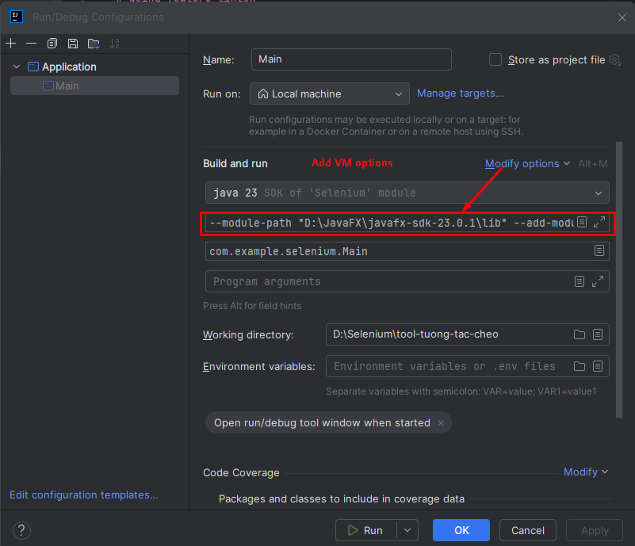
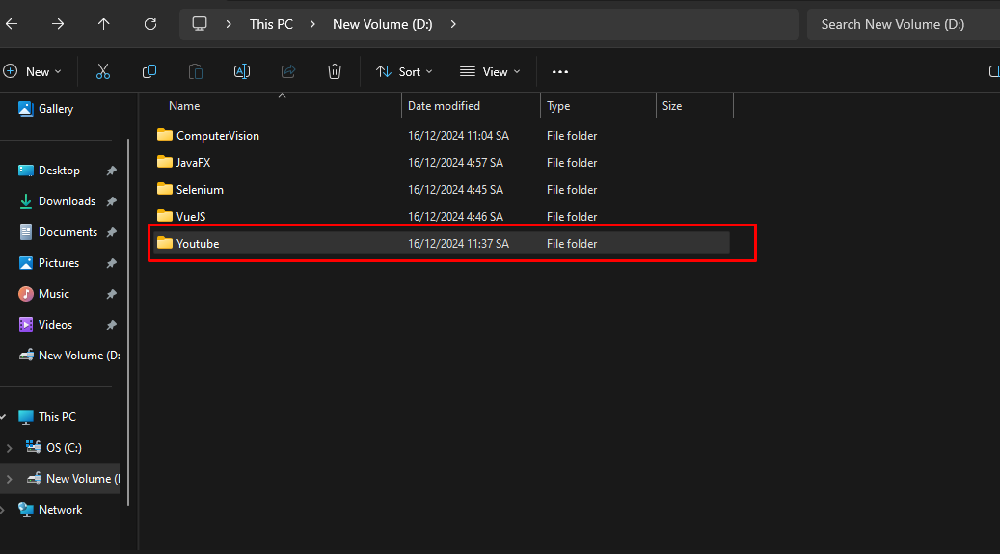

# tool-tuong-tac-cheo done feature facebook
# How to run

Install JavaFX SDK
```
    https://gluonhq.com/products/javafx/
```

Configurations
```
    --module-path "\path\to\javafx-sdk-23.0.1\lib" --add-modules javafx.controls,javafx.fxml
```
"\path\to\javafx-sdk-23.0.1\lib" is path JavaFX SDK

### Run with IDE Intellij


### Set up chrome driver

if program can not find chromedriver 
1. install chromedriver
2. extract chromedriver on resources/driver 
```
	https://storage.googleapis.com/chrome-for-testing-public/131.0.6778.108/win64/chromedriver-win64.zip
```

# File Relate
## Profile chrome 
When run profile chrome will save in D:\Youtube\ChromeProfile

