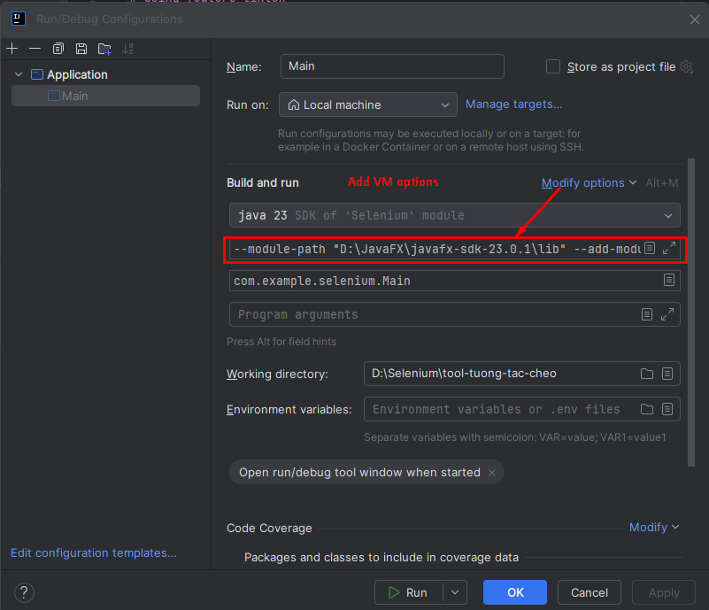

# tool-tuong-tac-cheo done feature facebook
# doing feature tiktok

---
# How to run

Install JavaFX SDK
```
    https://gluonhq.com/products/javafx/
```

Configurations
```
    --module-path "\path\to\javafx-sdk-23.0.1\lib" --add-modules javafx.controls,javafx.fxml
```
"\path\to\javafx-sdk-23.0.1\lib" is path JavaFX SDK

### Run with IDE Intellij
